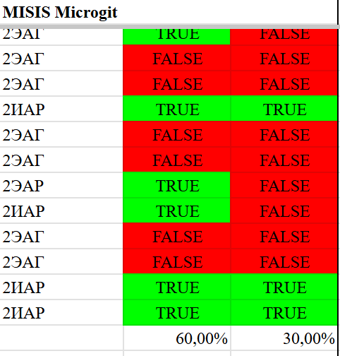

#TechFriend AI Challenge (1 место)

*MISIS Microgit team*

Team Members:

1. **Хабибуллин Адиль** - ML and DL
2. **Кайков Дмитрий**  - Fullstack
3. **Наумов Родион** - Data Analyst
4. **Елисеев Владислав** - ML and DS
5. **Соколов Артем** -  Fullstack

## Задача : Алгоритм глубокого понимания пользователя

>Конкретной целью Хакатона являлась разработка алгоритма, способного предоставить глубокое понимание пользователя на основе его активности в социальных сетях, а именно определить его психологический тип личности согласно типологии победителей прошлого Хакатона.

## Решение
-Сбор и генерация фичей данных с базы данных(Sql) в которой хранятся данные о пользователях Вконтакте,
были сгенерированы фичи начиная с количества друзей,групп до настроения текста постов, аватарок на странице(img2text),встречаемость восклицательных знаков, количество слов Я и тд.
-Все данные собираются в одну базу
-Т.К данные не были размечены, решили использовать unsloth/gemma-2-9b-it-bnb-4bit для разметки передевая данные о пользователе в нее и давая полную инструкцию в промпте
-Обучениe CatBoost на размеченных данных
-Сбор сервиса на FastAPI для дальнейшей интеграции 

## Метрики
Как таковой общей метрики не было,жюри которые являлись психологами оценивали лично на тестовой выборке из настояших людей VK оценивая страницу человека и наше предсказание,в конце нам выдали наши результаты.

